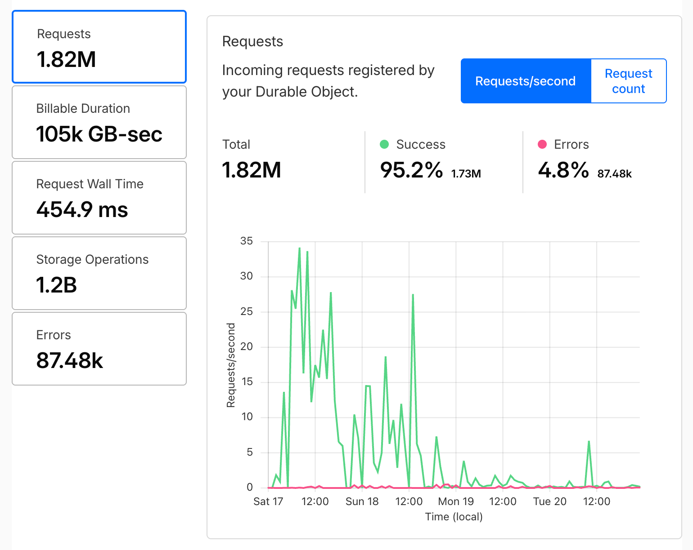
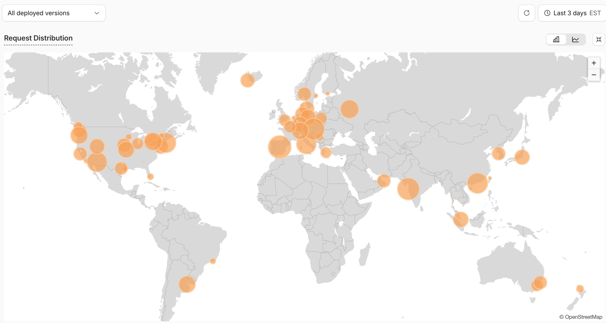

I'm responsible for the technical implementation of the Atlas of Mosaics round in the 2026 MIT Mystery Hunt, I'm writing this partially to confess my sins and partially to let the interested people know how it actually worked.

Firstly, a quick disclaimer, this blog post will contain spoilers for the [Atlas of Mosaics round from the 2026 MIT Mystery Hunt](https://puzzmon.world/rounds/atlas_of_mosaics), if you're concerned about spoilers, I'd recommend not reading further.

For the unfamiliar, Atlas of Mosaics was the third "dimension" round in the 2026 Mystery Hunt, the gimmick of it was that all of the puzzles were presented as a series of drag-and-drop puzzles on a hexagonal grid, where all of your team could see and interact with the puzzles at the same time.

Before I get to the details, I'd rather not take credit for other people's efforts, so I'll quickly narrow in on what'll be in this post. I was largely responsible for the details of the technical implementation of the round, but I didn't design any of the levels or puzzles, nor did I have a hand in the meta, and I only personally did the dev work one of the regions myself ([Crossing the Unknown](https://puzzmon.world/puzzles/crossing_the_unknown), written by Kevin Der). I'm a big brain developer and only a medium brain puzzle author.

## Rendering a Hexagonal Grid

While on an airplane, I wrote a css file that lets us render hexagonal grids. I'm pretty proud of it - it's a purely CSS solution that doesn't require any extra javascript. The most popular hexagonal grid rendering library is [react-hexgrid](https://www.npmjs.com/package/react-hexgrid), which is great, but it wasn't going to work for us because the base primitive is an SVG, and the hexagons on the grid are rendered as `polygon`s. That might have been ok in the end, but at the time I didn't know what sort of puzzles people were going to want to write, so something more flexible was preferable. I'm having a hard time recalling this exactly, but I believe drag-and-drop on `polygon` elements also had questionable support at the time.

A pure CSS implementation sort of maximizes the amount of interoperability we have with other libraries and techniques. As a result we don't have to do all that much to get hex grids to work with things like virtualization - a fun secret is that, for performance reasons, when you scroll around Atlas of Mosaics, we're only rendering the visible hexagons, the ones offscreen don't even exist in the DOM.

I'm so proud that I'm pretty confident that I'm going to clean up the CSS and publish it as a standalone library when I get some downtime.

## Specifying Levels on the Map

I really love systems design, especially when it comes to defining the rails that developers consume to build stuff. I defined the API for specifying levels on the map - it's an *admittedly pretty complicated* TypeScript builder pattern, where authors associate clues with the coordinates of the hexagon they're on, as well as the bank of hex tiles that are available to place on the level. The main benefit was that I had stood up a pattern that let the puzzle authors define their levels in a way that would let them avoid writing code that would leak the content of their puzzle in the JavaScript bundle of the round (I know y'all are looking at the devtools for hints, but I'm one step ahead of you). The strategy was to define hex rendering by splitting *how* to render a hex from *what* to render in it - for example, the client bundle contained an implementation of a `ColorTile` component, but the specific colors that were exposed in the level that used the `ColorTile` component was defined in the level specification that only got bundled with the level data on the server.

Reflecting on it, there are a few things I would have done differently - I focused a lot on TypeScript enforcement that would catch mistakes like "did you specify that you had an open slot here before you added a clue to this hex?", but in practice people tended to script out their levels from a spreadsheet, so that sort of error didn't end up happening much.

## The First Pass at Synchronization
In May, I did a proof of concept for synchronization, I was pretty interested in achieving a general-case synchronization scheme for any puzzle, so we could have the most interactive Mystery Hunt possible, so I went with [Automerge](https://automerge.org/) (SPOILER: THIS DECISION COST A LOT, THOUGH IT MIGHT HAVE BEEN A GOOD CALL AT THE TIME?), which is a general purpose CRDT library. For the unfamiliar, CRDTs are a class of algorithms that order edits to an object in a way that allows all clients can converge to the same state. The hypothetical result is that we don't have to be very clever about how we approach synchronization, we can lose messages over the wire, have clients go offline for a while, accept messages out of order, etc, and still have all clients come to a consensus.

I was a little overzealous trying to push this synchronization scheme into the main codebase - basically as I was ready to merge it into the main codebase, I was told that, for the safety of the hunt site, I needed to pull it out into some separate deployment, so that if we had some issues with it, we could address them separately or turn down synchronization entirely without affecting the hunt site. To be explicit, this is an extremely correct take, I probably should have just done this in the first place.

I went to deploy on a fleet of [Cloudflare Durable Objects](https://developers.cloudflare.com/durable-objects/), which are the most exciting thing I discovered over the course of the year. Semantically, they're like a serverless function, but with a persistent state attached. So, you don't manage a machine, you just deploy a function, and if it's no longer needed it gets garbage collected. When it's needed again, the function gets reinitialized as a fresh instance, and rehydrated with the state from the database.

On top of that, Cloudflare will hang on to a websocket attached to a Durable Object, so your function can get garbage collected and the websocket connection will remain alive, and it'll spin your function back up if new websocket messages come in. You only pay for the compute time when you're actually using the function, but you don't have to do any magic to manage websocket connections.

On top of THAT, Durable Objects are scoped to whatever namespace you like, so in our case we could have a separate namespace for each team. It's super easy to reason about multitenancy when your database is fully isolated at the team level!

The net effect is that, from the client it looks like you have an always-on websocket connection, and you're only paying for something close to the cost of the compute time you actually use.

The main downside is that Durable Objects are limited to 100MB of memory, which DID come into play...

## The First Tests
After merging this all in, I triumphantly announced before a testsolve that it would be the first test with synchronization in place. Once it got going, people started reporting that they were not seeing sync happen at all, sync might work for a short time, but at some point it would stop working entirely, reloading the page wouldn't address it.

I was pretty baffled, but the team was able to identify that at some point we were exceeding the 100MB memory limit of the Durable Objects. This in itself was difficult because Durable Objects don't provide much observability and they sample logging, so you might not even see the error log at all.

I spent a pretty long time trying to mitigate this issue - reducing the number and size of the edits that were being written to the Automerge document. These would have the effect of making the synchronization correct for incrementally longer periods of time, but never actually making it last the duration of a testsolve.

## The Looming Panic
Some time around the full round testsolve IN EARLY DECEMBER, I had done all I could to reduce the memory footprint of our Automerge implementation - it's pretty hard to get real interaction patterns when you're testing locally, the full round testsolve was the next chance to get real usage and see how it held up. And it stayed up... for about 7 minutes at a time. We ran a script to redeploy the Durable Objects every 7 minutes to have it shake off whatever issue it had.

This was the most stressful part of the hunt for me - I was in a state of high anxiety about this entire thing for the following weeks. I was pulling late nights trying to mash out an increasingly complex solution involving sharding the Automerge document even further, having teams have many Durable Objects, one per level, etc.

I remember telling my wife that I felt like I was heading for a major public embarrassment.

## Speculating on the Root Cause
Befor I tell you exactly what we did to salvage the situation, I'm going to take a moment to specualte on the root cause. I still don't have a real understanding, but this is my headcannon that fits the evidence I have so far.

I think the problem is that Automerge's (or more accurately `automerge-repo`'s) algorithm for finding out what clients have what document revisions prompts you to allocate unbounded memory to create messages between clients. My suspicion is that those were hitting some unstated limit of buffer size in the runtime of Durable Objects, meaning that clients couldn't send those too-large sync messages with eachother. The Durable Object itself wouldn't crash for some time after that while `automerge-repo` kept trying to do failed synchronization operations until the Durable Object ran out of memory all the way. Redeploying the Durable Object would clear the memory and allow the Durable Object to start from scratch again.

# The Solution
Looking back, I can't believe how close to hunt we actually had this conversation. On December 17th(!) at 5:30 PM, Herman said 
> I think there are some other higher level options for rearchitecting this such as getting rid of automerge entirely but I don’t think we could possibly implement (and throughly test) them without spending at least another ~1.5 weeks at the expense of the rest of hunt :/ 
> The actual syncing we’re doing is fairly straightforward since we are essentially just updating a key-value store where both keys and values are strings

Which tickled my brain, I had tunnel-visioned on Automerge earlier in the year because I didn't know what sort of puzzles people were going to write - someone could have wanted a tile they could write on or something like that. But *now* we were past the point where people were going to be ideating new puzzles - we had actually landed our constraints, and lucky for us we had a very simple set of constraints that could be built in to something fully custom.

Herman and Kevin continued to speculate about other deployments to additionally increase the available memory, but I suggested that one Durable Object per team with a simpler scheme would not be in danger of memory problems. Admittedly, I didn't know how we'd handle conflicts then, but Kevin came back with:
```text
Option B (still very simple, and matches your “two up-to-date clients both succeed” requirement better): per-key version (CAS)
Server state per key: { value: string, ver: int } (default ver=0 if missing).
Client caches: { value, ver } per key (or fetches it before editing).
Client update message: { key, value, baseVer } where baseVer is what the client last saw for that key.
Server rule:
If baseVer != currentVer(key): reject (stale write). Return { currentValue, currentVer } so client can refresh and decide what to do.
Else: set value, increment ver.
Two up-to-date clients edit different keys → both succeed (they don’t conflict).
Two up-to-date clients edit the same key → only one “wins” (first accepted); the other is rejected and must refresh/retry (or show conflict).
```

Which, he later clarified that this was basically the Check-and-Set algorithm, borrowed from memcached. This was all of the pieces that needed to come together.

I think of those three insights as a perfect moment of collaboration that saved the round.

At 10:49 that night I had hacked out sync logic, and after work the following day I had the conflict resolution out. The insights and probing from the team were incredibly critical - I had spent so much time trying to bend Automerge to work for us, and over the course of 2 evenings I had fully pivoted like 4 months of trying out of the codebase, and the result was a fully functional synchronization scheme that we understood enough to be confident in.

To describe the whole thing - when a client opened up the round page, we'd spin up a websocket connection to a Durable Object scoped to the team, and flow back the current state of the round, which the client would treat as the source of truth. When a client made a change, we first checked whether it was based on a recent enough state of the elements they were modifying, then we'd apply the change as an appended list of edits in the state of the Durable Object. At the same time we'd make the update to the in-memory state of the round. Then we'd flow the contents of the level being modified out to all clients, who would simply replace their local state with the new state. If a Durable Object was garbage collected and brought back online, we'd recreate the in-memory state of the round by replaying all of the edits that had been applied to it.

In the following days we did some work to make it a little more performant, but it didn't need any major changes to serve hunt.

## The Hunt
We scheduled our shifts for the hunt to have good coveage of tech people at all times. I'm a morning person, so I was off the schedule for sleep between 10 PM and 5 AM. Providence unlocked Atlas of Mosaics at 10:45 PM, approximately 15 minutes after my head hit the pillow. I was on edge the whole night - my anxiety about Atlas was powerful enough to negate even the slightest effects of the melatonin I took to try to force myself to sleep, I never even got drowsy that night.

*Somehow, no problems? The whole weekend?* It was incredible.

I wasn't able to get immediate feedback on it, I was otherwise focused on tasks for keeping the hunt running smoothly so I didn't get to see how people were reacting to it live, but it was a no-news-is-good-news situation. I briefly left the dev corner to do a team visit to see a team that had just unlocked Atlas, but it turned out that it was mostly their remote contingent that was working on it. 🤷

The only weekend feedback I managed to take in was a single comment from the Puzzler's Club discord:
> i don't think this is too much of a spoiler but lemme say that atlas is an all-timer round

Hell yes.

## The Aftermath
The evening before wrapup, I stayed up late pulling together an animation of Providence's activity on the map. I did that by pulling down all of Providence's edits from the Durable Object and replaying them as fast as possible. I didn't need reactivity, so all of the changes were simply imperatively applied to the DOM. Here it is:

<iframe width="560" height="315" src="https://www.youtube.com/embed/ZeRD5khRQdQ?si=Bgyf8cGHRu3UaQkL" title="YouTube video player" frameborder="0" allow="accelerometer; autoplay; clipboard-write; encrypted-media; gyroscope; picture-in-picture; web-share" referrerpolicy="strict-origin-when-cross-origin" allowfullscreen></iframe>

I wasn't expecting the applause to come when we got to the Atlas slide during wrapup, but holy hell did it feel great.

Since Hunt there have been a number of blogposts and discussions mentioning Atlas, just curating the compliments:

<blockquote>
  <p>The Atlas of Mosaics. This is so fuckin cool. A technical marvel, I'm SUPER impressed with the fact that this worked at all, let alone as smoothly as it seemed to be.</p>
  <footer>
    <cite><a href="https://puzzbee.substack.com/p/this-is-the-metapuzzle-zone-mitmh2026">BuzzBee</a></cite>
  </footer>
</blockquote>

<blockquote>
  <p>Atlas of Mosaics: This round was so hype and also so insane tech-wise. I don't want to think about how long it took to set this up.</p>
  <footer>
    <cite><a href="https://www.alexirpan.com/2026/01/29/mh-2026.html">alexirpan</a></cite>
  </footer>
</blockquote>

*Feed my ego.*

## Stats


Looks like we served 1.8 million sessions over the course of the hunt, using only 105k GB-seconds of compute time. For reference, Cloudflare's worker paid plan is 5 dollars a month and comes with 500k GB-seconds of compute time. Don't look too closely at the errors, I found that if you close a tab the websocket marks itself as closed unexpectedly and throws an error for us (maybe two?). I'm not gonna try to debug it.


It feels pretty neat that people from all over the world engaged.


## Takeaways

I'm glad Atlas was well received, I'm glad it worked, and I'm glad I got to be part of it.

To distill the stuff I learned this year, I'd say:
 - Trading an blackbox problem for a larger scoped but well understood problem feels very good.
 - Durable Objects have some limitations, but also some serious potential. I hesitate to recommend them wholesale because we struggled with them a bit, but my intution says they're a super cheap way to deploy things that could be explored.
 - Loadtest early.

I still dream about a general case solution for puzzle synchronization, maybe that's a project now that my free time is returning.

